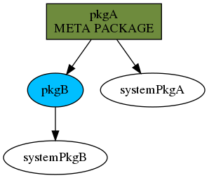

# rpm-spec-dependency-analyzer

[](https://badge.fury.io/py/rpm-spec-dependency-analyzer)

This is a simple Python3 script that parses a list of SPEC files and
generates a nice graph of the dependencies among them using DOT.


## How to install

```
pip3 install rpm-spec-dependency-analyzer
```

## How to use

```
rpm_spec_dependency_analyzer --output reqgraph.dot /my/spec/folder/*.spec
dot -Tpng reqgraph.dot -o reqgraph.png
```

## Example output

This is the example of the graph generated by [pkgA.spec](examples/pkgA.spec) and by [pkgB.spec](examples/pkgB.spec):



Original .dot source is available [here](examples/example-graph.dot)
